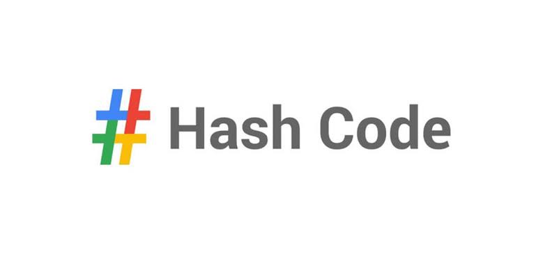

# BizkAI on Hashcode 2022

This is the time we go to Dublin guys!

## One Pizza solution description

1. Build a graph where the nodes are the clients and there is an edge between clients that are not compatible, e.g. one likes tomato and the other dislikes it, thus there is no possible pizza that can satisfy both of them.
2. Take a random independent set from that graph as the initial solution.
3. Randomly drop 25-50% of nodes from the best solution so far.
4. Complete the dropped independent set randomly.
5. Check if the score improved, and if so, save the solution as the best one so far.
6. Go to step 3.

Using this approach for 10k iterations (~ 1.5 sec execution time) we managed to get the scores below:

|   a   |   b   |   c   |   d   |   e   |
| :---: | :---: | :---: | :---: | :---: |
|   2   |   5   |   5   |  1771 |  2020 |

__Total score__: 3803
